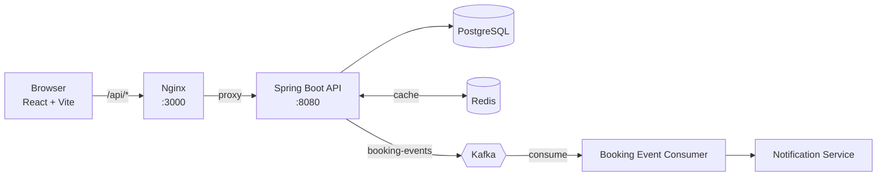
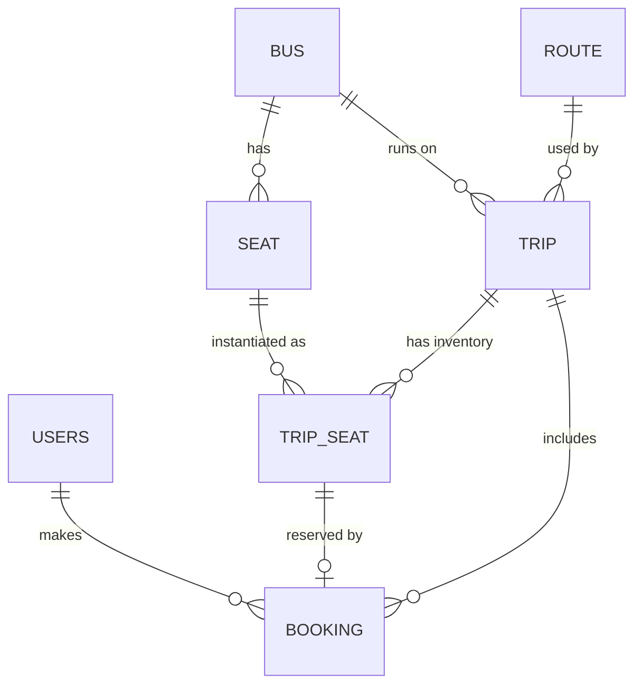

# 🚌 SeatWars — Bus Ticket Booking Platform

A full-stack bus booking system where customers search trips, pick seats on a live seat map, and book tickets, while admins manage buses, seat layouts, routes and trips. The backend is built around **JWT security, Redis caching and Kafka event-driven notifications**, not just CRUD.


---

## ✨ Features

**Customers**
- Register / log in (JWT, stateless auth)
- Search trips by source, destination and travel date
- Interactive seat map showing Available / Selected / Booked seats
- Book a seat with passenger details (name, age, gender)
- View booking history and cancel bookings (seat is released back to inventory)

**Admins**
- Manage buses and configure each bus's seat layout
- Manage routes (source → destination)
- Schedule trips (bus + route + date + departure/arrival time); per-trip seat inventory is generated automatically
- Protected admin panel with dashboard

**Platform**
- Role-based access control (`CUSTOMER`, `ADMIN`)
- Redis caching for routes and trip search results
- Kafka event published on every booking, consumed asynchronously by a notification service
- Centralised exception handling with meaningful HTTP status codes (404 / 409 / 401 / 403)
- One-command startup with Docker Compose

---

## 🏗️ Architecture



**Booking flow**

1. Customer selects a seat and submits passenger details → `POST /api/bookings`
2. Backend validates the trip and seat, marks the `TripSeat` as `BOOKED`, and saves a `CONFIRMED` booking in one transaction
3. A `BookingCreatedEvent` is published to the Kafka topic `booking-events`
4. The consumer (group `pasara-booking-consumer`) picks it up and hands it to `NotificationService` to send the confirmation

**Caching**

| Cache | What | Invalidation |
|-------|------|--------------|
| `routes` | Route list | Evicted on any route create / update / delete |
| `trips` | Trip search results, keyed by `source:destination:date` | Keyed per search (case-insensitive source/destination) |

---

## 🧰 Tech Stack

| Layer | Technology |
|-------|-----------|
| Backend | Java 25, Spring Boot 4.1, Spring Web MVC, Spring Data JPA (Hibernate), Spring Security, Bean Validation, Actuator, Lombok |
| Auth | JWT (jjwt 0.12.6), BCrypt password hashing, stateless sessions |
| Database | PostgreSQL 17 |
| Cache | Redis 8 (Spring Cache, JSON serialisation) |
| Messaging | Apache Kafka 4.0 (KRaft mode, no ZooKeeper), Spring Kafka |
| Frontend | React 19, TypeScript, Vite 8, Tailwind CSS 4, React Router 7, Axios, Lucide icons |
| Serving | Nginx (static build + reverse proxy to the API) |
| DevOps | Docker, Docker Compose, Maven Wrapper |

---

## 🗂️ Project Structure

```
seatwars/
├── docker-compose.yml          # Postgres, Redis, Kafka, backend, frontend
├── backend/
│   ├── Dockerfile
│   ├── pom.xml
│   └── src/main/java/com/pasara/backend/
│       ├── config/             # Security, Redis, CORS, default admin seeding
│       ├── controller/         # Auth, Bus, Seat, Route, Trip, Booking REST controllers
│       ├── service/            # Business logic, Kafka producer/consumer, notifications
│       ├── Model/              # JPA entities + enums
│       ├── repository/         # Spring Data repositories
│       ├── dto/                # Request/response objects + Kafka event
│       ├── security/           # JWT filter, UserDetailsService
│       └── exception/          # Custom exceptions + GlobalExceptionHandler
└── frontend/
    ├── Dockerfile              # Multi-stage: Node build → Nginx
    ├── nginx.conf              # SPA fallback + /api proxy
    └── src/
        ├── api/                # Axios instance + per-resource API modules
        ├── components/         # UI kit, SeatMap, TripCard, SearchForm, layouts, route guards
        ├── context/, hooks/    # Auth context and useAuth
        ├── pages/              # Home, Search, Trip, Booking, Auth, Admin
        └── types/, utils/
```

---

## 🗄️ Data Model



- **Seat** is the physical seat on a bus; **TripSeat** is that seat's availability on one specific trip (`AVAILABLE` / `BOOKED`). Creating a trip generates a `TripSeat` for every seat of the assigned bus.
- **Booking** status is `CONFIRMED` or `CANCELLED`.
- Schema is created and updated automatically by Hibernate (`ddl-auto=update`).

---

## 🚀 Getting Started

### Prerequisites
- Docker & Docker Compose
- JDK 25 (to build the backend jar)
- Node.js 22+ (only if you want to run the frontend in dev mode)

### 1. Clone
```bash
git clone https://github.com/PrasadK2402/seatwars.git
cd seatwars
```

### 2. Build the backend jar
The backend `Dockerfile` packages a pre-built jar, so build it first:
```bash
cd backend
./mvnw clean package -DskipTests
cd ..
```

### 3. Start everything
```bash
docker compose up --build
```

| Service | URL |
|---------|-----|
| Web app | http://localhost:3000 |
| REST API | http://localhost:8080/api |
| Kafka (host access) | localhost:9092 |

### 4. Log in
A default admin account is seeded on first startup:

| Role | Email | Password |
|------|-------|----------|
| Admin | `admin@pasara.com` | `admin123` |

Customers can sign up from the **Register** page.

> ⚠️ The compose file ships with demo credentials (DB password, `JWT_SECRET`) and a default admin. Change all of them before deploying anywhere public.

### Frontend dev mode (hot reload)
With the stack running in Docker, you can run the UI separately. Vite proxies `/api` to `localhost:8080`:
```bash
cd frontend
npm install
npm run dev        # http://localhost:5173
```

---

## ⚙️ Configuration

Backend environment variables (set in `docker-compose.yml`):

| Variable | Purpose | Example |
|----------|---------|---------|
| `DB_URL` | JDBC URL | `jdbc:postgresql://postgres:5432/seatwars` |
| `POSTGRES_USER` / `POSTGRES_PASSWORD` | DB credentials | `postgres` / *your password* |
| `REDIS_HOST` / `REDIS_PORT` | Redis connection | `redis` / `6379` |
| `KAFKA_BOOTSTRAP_SERVERS` | Kafka brokers | `kafka:9092` |
| `JWT_SECRET` | Signing key for JWTs (use a long random value) | — |

Frontend: `VITE_API_BASE_URL` (defaults to `/api`, see `frontend/.env.example`).

---

## 📡 API Reference

All endpoints are prefixed with `/api`. Protected endpoints expect `Authorization: Bearer <token>`.

### Auth
| Method | Endpoint | Access | Description |
|--------|----------|--------|-------------|
| POST | `/auth/register` | Public | Create a customer account, returns JWT |
| POST | `/auth/login` | Public | Log in, returns JWT + user info |

### Trips & Seats
| Method | Endpoint | Access | Description |
|--------|----------|--------|-------------|
| POST | `/trips/search` | Public | Search by `source`, `destination`, `travelDate` (cached) |
| GET | `/trips/{tripId}/seats` | Public | Seat availability for a trip |
| GET | `/trips/{id}` | Authenticated | Trip details |
| GET / POST | `/trips` | Admin | List / create trips |

### Bookings
| Method | Endpoint | Access | Description |
|--------|----------|--------|-------------|
| POST | `/bookings` | Customer | Book a seat (`tripId`, `tripSeatId`, passenger details) |
| GET | `/bookings/my-bookings` | Customer | Current user's bookings, newest first |
| POST | `/bookings/{id}/cancel` | Customer | Cancel own booking and free the seat |

### Admin — Buses, Seats, Routes
| Method | Endpoint | Access | Description |
|--------|----------|--------|-------------|
| GET / POST | `/buses` | Admin | List / create buses |
| GET / PUT / DELETE | `/buses/{id}` | Admin | Read / update / delete a bus |
| GET / POST | `/buses/{busId}/seats` | Admin | List / add seats for a bus |
| GET | `/routes`, `/routes/{id}` | Public | Read routes (cached) |
| POST / PUT / DELETE | `/routes`, `/routes/{id}` | Admin | Manage routes |

### Error codes
| Status | Meaning |
|--------|---------|
| 401 | Invalid credentials / missing token |
| 403 | Not allowed (e.g. cancelling someone else's booking) |
| 404 | Bus, route, trip or booking not found |
| 409 | Seat no longer available, booking already cancelled, or email already registered |

---

## 🔐 Security

- Stateless JWT authentication via a custom `JwtAuthenticationFilter`
- Passwords hashed with BCrypt
- Method- and route-level role checks (`ADMIN` for management endpoints, `CUSTOMER` for bookings)
- CORS restricted to the local frontend origins (`:5173` dev, `:3000` Docker)
- Frontend route guards (`RequireAuth`, `RequireAdmin`) and automatic session clearing on `401`

---

## 🗺️ Roadmap

- [ ] Guard seat booking against simultaneous requests for the same seat (optimistic/pessimistic locking or a Redis-based seat lock with TTL)
- [ ] Real notification delivery (email/SMS) from the Kafka consumer instead of console output
- [ ] Evict the `trips` search cache when new trips are created, and add a TTL
- [ ] Payment integration
- [ ] Externalise secrets and CORS origins, use Flyway migrations instead of `ddl-auto=update`
- [ ] Integration tests with Testcontainers (Postgres, Redis, Kafka)
- [ ] Pagination for admin lists and booking history

---

## 👤 Author

**Prasad** — B.Tech Information Technology, Walchand College of Engineering, Sangli
GitHub: [@PrasadK2402](https://github.com/PrasadK2402)
